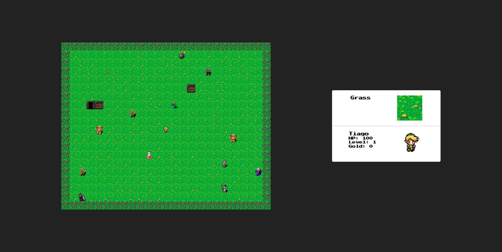
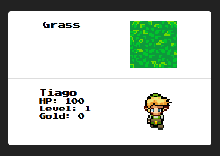
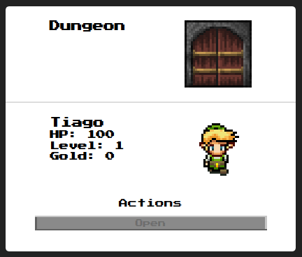
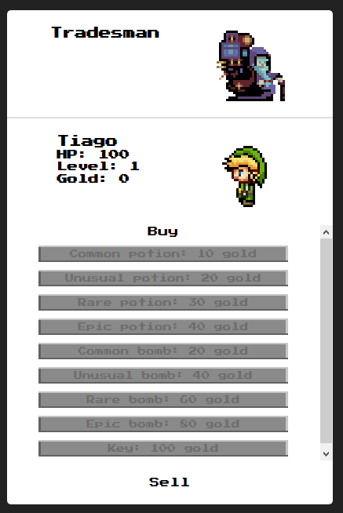
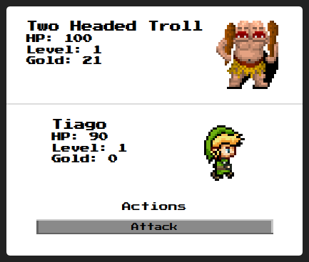
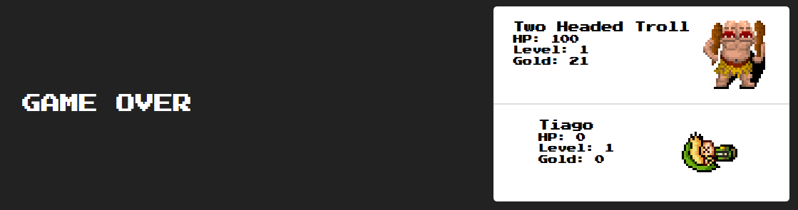
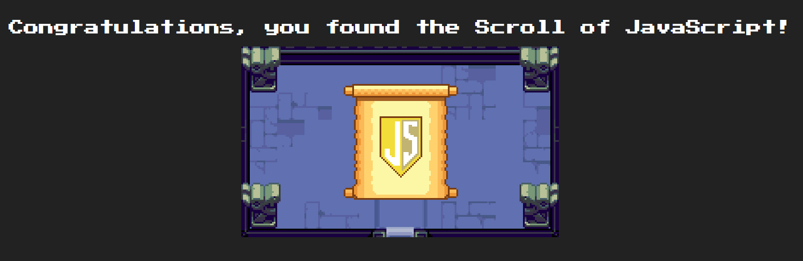

# Adventure Game

Browser-based game created with Object-Oriented Programming and DOM manipulation in Javascript. Graphics were adapted from publicly available assets or created from scratch.

Gameplay is very simple: the user moves the character using the keyboard, and all actions are performed by clicking buttons on the screen. Once the user opens the dungeon where the prize is, the quest is finished.

For this project, the instructor provided a basic frame with instructions and a general structure.

## [Play it here!](https://tiagomota79.github.io/adventure-game)

## Screenshots

###### _[Link sprites](https://www.spriters-resource.com/custom_edited/thelegendofzeldacustoms/sheet/17402/) designed by [Fox from ZFGC](https://www.spriters-resource.com/submitter/Fox/)_

###### _Link, Zelda and all related content © Nintendo_
